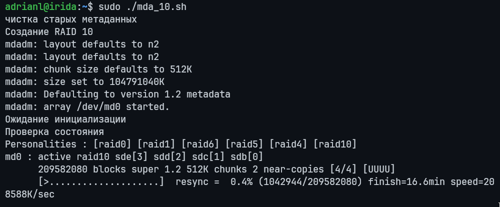
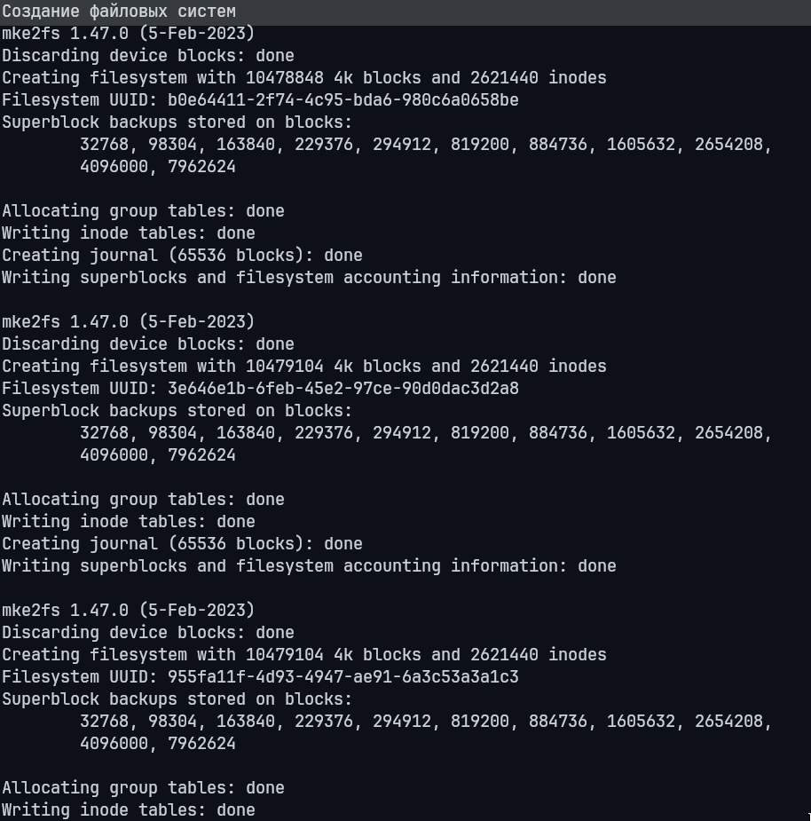
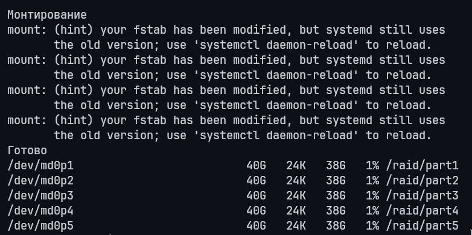
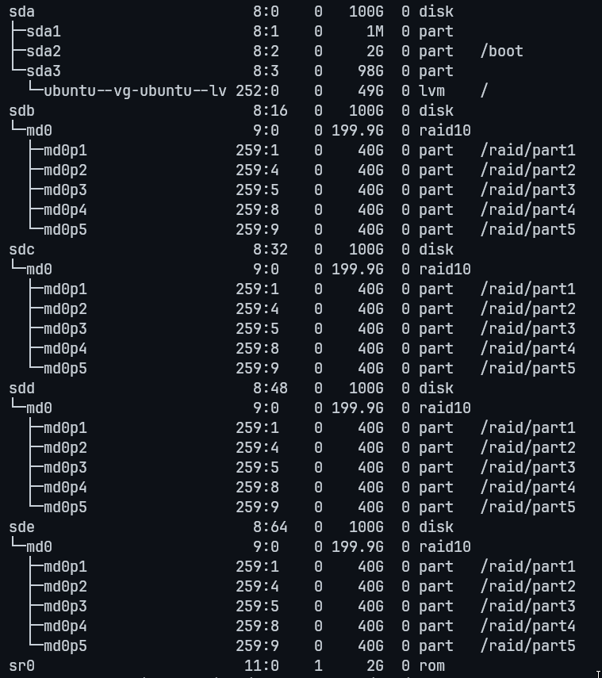
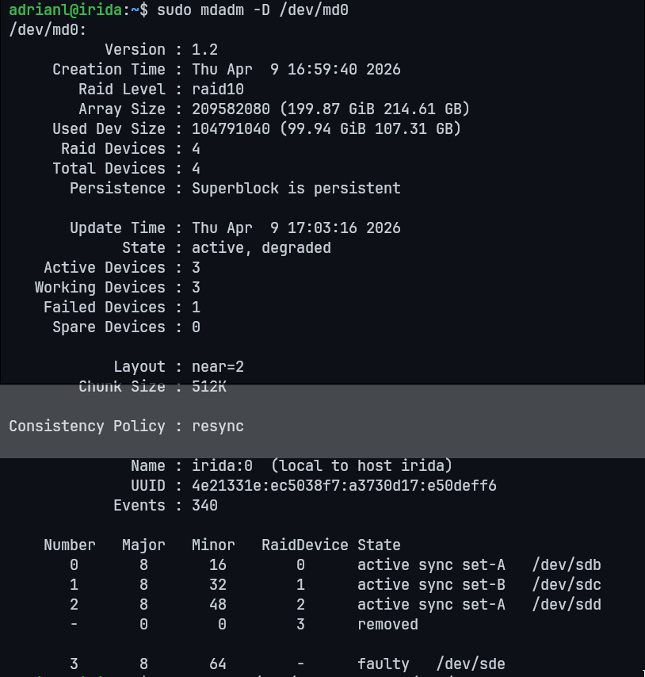
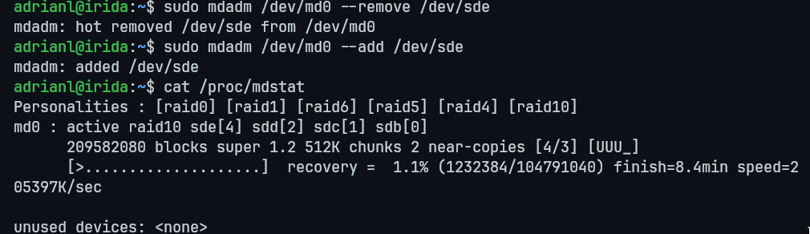
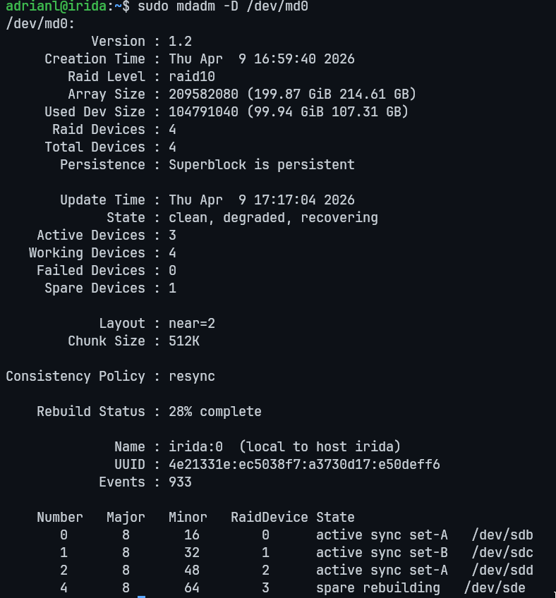
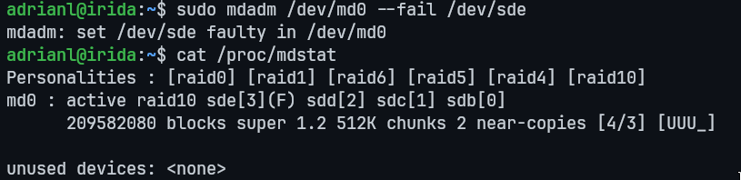

# Работа с mdadm

## Цель
научиться использовать утилиту для управления программными RAID-массивами в Linux;

---

## Задание

• Добавьте в виртуальную машину несколько дисков

• Соберите RAID-0/1/5/10 на выбор

• Сломайте и почините RAID

• Создайте GPT таблицу, пять разделов и смонтируйте их в системе.

---

## Выполнено

В рамках задания реализовано тестирование RAID 10:

* Подключены 4 диска: `/dev/sdb`–`/dev/sde`
* Создан массив `/dev/md0`
* Выполнена GPT-разметка и создано 5 разделов
* Разделы отформатированы и смонтированы
* Смоделирован отказ диска
* Выполнено восстановление массива

---

## 1. Создание RAID 10

Массив собран из 4 дисков с метаданными версии 1.2.

```bash
sudo ./mda_10.sh
```

### Скрипт выполняет

* очистку старых superblock’ов
* создание RAID 10
* ожидание синхронизации
* сохранение конфигурации
* разметку и монтирование

### Скриншот выполнения



---

<details>
<summary>Полный вывод</summary>
adrianl@irida:~$ sudo ./mda_10.sh 
чистка старых метаданных
Создание RAID 10
mdadm: layout defaults to n2
mdadm: layout defaults to n2
mdadm: chunk size defaults to 512K
mdadm: size set to 104791040K
mdadm: Defaulting to version 1.2 metadata
mdadm: array /dev/md0 started.
Ожидание инициализации
Проверка состояния
Personalities : [raid0] [raid1] [raid6] [raid5] [raid4] [raid10] 
md0 : active raid10 sde[3] sdd[2] sdc[1] sdb[0]
      209582080 blocks super 1.2 512K chunks 2 near-copies [4/4] [UUUU]
      [>....................]  resync =  0.4% (1042944/209582080) finish=16.6min speed=208588K/sec
      
unused devices: none
Сохранение конфигурации
ARRAY /dev/md0 metadata=1.2 UUID=4e21331e:ec5038f7:a3730d17:e50deff6
Разметка GPT и создание разделов
Создание файловых систем
mke2fs 1.47.0 (5-Feb-2023)
Discarding device blocks: done                            
Creating filesystem with 10478848 4k blocks and 2621440 inodes
Filesystem UUID: b0e64411-2f74-4c95-bda6-980c6a0658be
Superblock backups stored on blocks: 
	32768, 98304, 163840, 229376, 294912, 819200, 884736, 1605632, 2654208, 
	4096000, 7962624

Allocating group tables: done                            
Writing inode tables: done                            
Creating journal (65536 blocks): done
Writing superblocks and filesystem accounting information: done   

mke2fs 1.47.0 (5-Feb-2023)
Discarding device blocks: done                            
Creating filesystem with 10479104 4k blocks and 2621440 inodes
Filesystem UUID: 3e646e1b-6feb-45e2-97ce-90d0dac3d2a8
Superblock backups stored on blocks: 
	32768, 98304, 163840, 229376, 294912, 819200, 884736, 1605632, 2654208, 
	4096000, 7962624

Allocating group tables: done                            
Writing inode tables: done                            
Creating journal (65536 blocks): done
Writing superblocks and filesystem accounting information: done   

mke2fs 1.47.0 (5-Feb-2023)
Discarding device blocks: done                            
Creating filesystem with 10479104 4k blocks and 2621440 inodes
Filesystem UUID: 955fa11f-4d93-4947-ae91-6a3c53a3a1c3
Superblock backups stored on blocks: 
	32768, 98304, 163840, 229376, 294912, 819200, 884736, 1605632, 2654208, 
	4096000, 7962624

Allocating group tables: done                            
Writing inode tables: done                            
Creating journal (65536 blocks): done
Writing superblocks and filesystem accounting information: done   

mke2fs 1.47.0 (5-Feb-2023)
Discarding device blocks: done                            
Creating filesystem with 10479104 4k blocks and 2621440 inodes
Filesystem UUID: 5a5fe345-5be4-4e73-aec4-9ccd9ff58558
Superblock backups stored on blocks: 
	32768, 98304, 163840, 229376, 294912, 819200, 884736, 1605632, 2654208, 
	4096000, 7962624

Allocating group tables: done                            
Writing inode tables: done                            
Creating journal (65536 blocks): done
Writing superblocks and filesystem accounting information: done   

mke2fs 1.47.0 (5-Feb-2023)
Discarding device blocks: done                            
Creating filesystem with 10478848 4k blocks and 2621440 inodes
Filesystem UUID: 6de85cb7-01a7-408a-8994-328fe10702fd
Superblock backups stored on blocks: 
	32768, 98304, 163840, 229376, 294912, 819200, 884736, 1605632, 2654208, 
	4096000, 7962624

Allocating group tables: done                            
Writing inode tables: done                            
Creating journal (65536 blocks): done
Writing superblocks and filesystem accounting information: done   

Монтирование
mount: (hint) your fstab has been modified, but systemd still uses
       the old version; use 'systemctl daemon-reload' to reload.
mount: (hint) your fstab has been modified, but systemd still uses
       the old version; use 'systemctl daemon-reload' to reload.
mount: (hint) your fstab has been modified, but systemd still uses
       the old version; use 'systemctl daemon-reload' to reload.
mount: (hint) your fstab has been modified, but systemd still uses
       the old version; use 'systemctl daemon-reload' to reload.
Готово
/dev/md0p1                          40G   24K   38G   1% /raid/part1
/dev/md0p2                          40G   24K   38G   1% /raid/part2
/dev/md0p3                          40G   24K   38G   1% /raid/part3
/dev/md0p4                          40G   24K   38G   1% /raid/part4
/dev/md0p5                          40G   24K   38G   1% /raid/part5
</details>

---

## 2. Разметка, файловые системы и монтирование

### Выполненные операции

1. Создание GPT:

```bash
parted /dev/md0 mklabel gpt
```

2. Создание разделов: `md0p1`–`md0p5`
3. Форматирование:

```bash
mkfs.ext4
```

4. Монтирование:

```bash
/raid/part1 ... /raid/part5
```

### Скриншоты

#### Разметка и создание ФС



#### Монтирование



---

## 3. Структура устройств

```bash
lsblk
```



---

## 4. Имитация отказа диска

Диск `/dev/sde` помечен как сбойный и удалён:

```bash
sudo mdadm /dev/md0 --fail /dev/sde
sudo mdadm /dev/md0 --remove /dev/sde
```

Проверка состояния:

```bash
cat /proc/mdstat
mdadm -D /dev/md0
```

### Скриншоты

#### Degraded состояние



#### Удаление диска



* состояние массива: `degraded`
* статус: `[UUU_]`
* 1 диск отсутствует
* массив продолжает работать

---

## 5. Восстановление массива

Добавление диска обратно:

```bash
sudo mdadm /dev/md0 --add /dev/sde
```

### Скриншот восстановления



* диск получает статус `spare rebuilding`
* запускается процесс `recovery`
* после завершения: `[UUUU]`, состояние `clean`

---

## 6. Ошибки и диагностика

Пример возможного сбоя:



---

## Итог

* Развернут RAID 10
* Настроена GPT-разметка и файловые системы
* Смоделирован отказ диска
* Выполнено восстановление массива

---

## Конфигурация

* `/etc/mdadm/mdadm.conf` — сохранён массив
* `/etc/fstab` — добавлены точки монтирования

Все операции выполнялись с использованием `sudo`.

---
